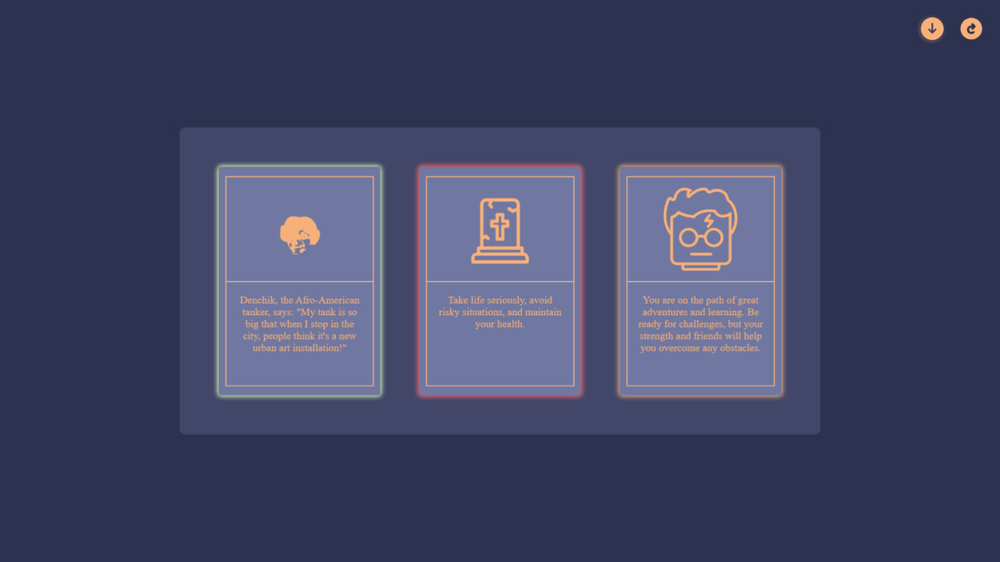

# Mystic Sights

This project is a website featuring animated cards with minimalist design, implemented using HTML, CSS, JS, and SASS. The site is now adaptive for mobile devices.

## Functionality

The web application includes the following features:

- 3D animation for flipping cards.
- Randomization of cards predicting your ✨ fate ✨.
- A page refresh button to update the card content.
- New features:
  - Ability to upload images for cards, including personal predictions.
  - Added animations and sound effects.
  - Cards are now categorized into: bad, normal, and great predictions.
  - Added an easter egg about my best friend Denis.

## Usage

To replace the default images with your own, download SVG images into the image/cards/ directory. In the data.js file, specify your data in the following format: "image name": {"card description", "card-type"}. All elements are generated in this file. To increase the number of cards, modify the 'num' parameter in the createAndAppendCards function.
Additionally, a mixin for resizing the cards is implemented. If the cards appear too large, you can adjust their size in the styles.css file using the sizeCard mixin.
If someone wants to use the site to upload their own cards, they need to specify the type of card additionally.

## Screenshots

Initial screen:
   
All cards open:
   
Uploaded image:
   

## Contact

For any questions or suggestions regarding this project, feel free to contact me via [LinkedIn](https://www.linkedin.com/in/bohdan-rudenko-b5726928a/).
